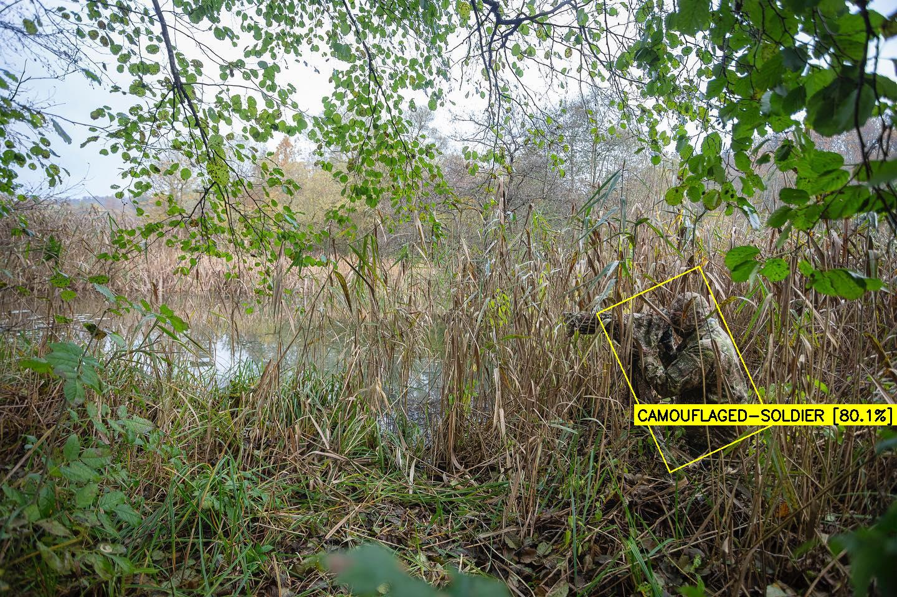
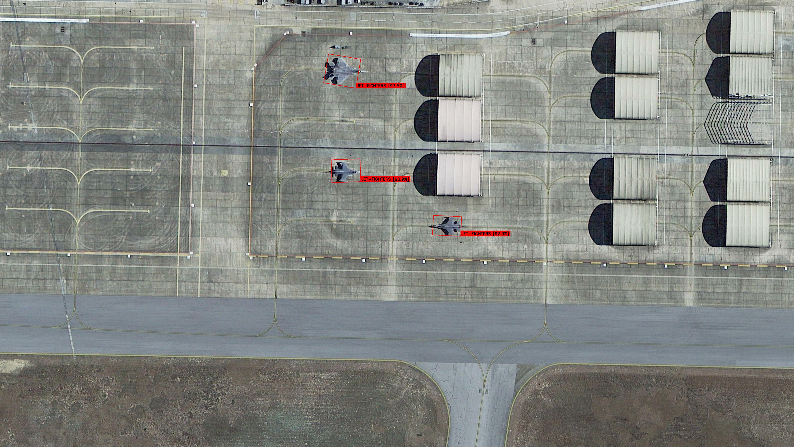

# 🦅 WarSight: Tactical Object Detection System
### High-Fidelity OBB Detection for Military & Drone Reconnaissance

**WarSight** is a production-grade AI research project focused on **Oriented Bounding Box (OBB)** detection for tactical assets. Built on a unified abstraction layer supporting **YOLOv8** and **YOLOv26**, the system integrates a sophisticated data engineering pipeline and an interactive Tactical Dashboard.

---

## 🚀 Core Features

- **🎯 Precision OBB Detection**: Detects 14 military classes with rotation-aware bounding boxes for superior accuracy in aerial and satellite perspectives.
- **🧠 Explainable AI (XAI)**: Integrated **Grad-CAM (Spatial Loss Version)** to visualize model decision-making and feature importance.
- **⚡ Ultra Dataset Pipeline**: A custom engineering journey that solved data imbalance, coordinate corruption, and "Ghost Target" artifacts.
- **🌡️ Tactical HUD & Thermal Mode**: Real-time web-based interface with simulated thermal vision and a military-grade Head-Up Display (HUD).
- **📹 Background Video Processing**: Asynchronous processing for long-range reconnaissance footage with real-time status tracking.

---

## 📂 Project Architecture

```text
CV/
├── app/                  → FastAPI Tactical Dashboard (Web UI)
├── configs/              → Experiment YAMLs (YOLOv8 & YOLOv26)
├── dataset/              → Raw & Processed (Ultra) Data (Git Ignored)
├── evaluation/           → Model benchmarking & Comparison tools
├── models/               → Unified Abstraction Layer & Factory
│   ├── base/             → Parent classes for detection logic
│   ├── custom/           → XAI (Grad-CAM) & Post-Processing Engines
│   ├── YOLOv8/           → Ultralytics YOLOv8 Integration
│   └── YOLOv26/          → Advanced YOLOv26 Implementation
├── preprocessing/        → The "Ultra" Pipeline scripts
├── results/              → Trained weights & Experiment logs
└── sampling/             → Dataset analysis & Visualization
```

---

## 🛠 The "Ultra" Pipeline: Engineering Excellence
We moved beyond standard training by building a custom data integrity layer:

1.  **Mathematical Zoom Engine**: Uses trigonometric scaling ($Z = \cos(\theta) + \sin(\theta) \cdot \max(W/H, H/W)$) to eliminate "Black Corners" during rotation without resorting to "Ghosting" mirror artifacts.
2.  **Coordinate Sanitization**: Automatic repair of Out-of-Bounds (OOB) labels and removal of degenerate boxes using the Shoelace Area Formula.
3.  **Class-Aware Augmentation**: Strategic multipliers (up to 15x) for rare assets like **Radar** and **Missile Launchers** to solve the extreme 1:45 class imbalance.

---

## 📡 Tactical Dashboard (Web UI)
The system includes a modern FastAPI-powered interface:
- **Analyze Image/Video**: Real-time inference with OBB HUD.
- **XAI Visualization**: Generate Grad-CAM heatmaps to verify target identification.
- **Thermal Vision**: Simulate night-ops thermal scanning.
- **Live HUD**: Class counts, confidence metrics, and coordinate telemetry.

---

## 🔬 Detection Classes
| Class | ID | Class | ID |
| :--- | :--- | :--- | :--- |
| **Artillery** | 0 | **Military Truck** | 7 |
| **Camouflaged Soldier**| 1 | **Missile** | 8 |
| **Civilian** | 2 | **Missile Launcher** | 9 |
| **Drone** | 3 | **Radar** | 10 |
| **Helicopter** | 4 | **Soldier** | 11 |
| **Jet Fighter** | 5 | **Tank** | 12 |
| **Machine Gun** | 6 | **Handgun** | 13 |

---

## 🛠 Installation & Usage

1. **Environment Setup**:
   ```bash
   pip install -r requirements.txt
   ```

2. **Launch the Tactical Dashboard**:
   ```bash
   python app/app.py
   ```
   Access the UI at `http://localhost:5000`

3. **Inference Snippet**:
   ```python
   from models.model_factory import load_model
   
   model = load_model("yolov26", "results/YOLOv26/exp3/best.pt")
   model.load()
   results = model.predict(image_np)
   ```

---

## 📷 Detection Showcase

### 📹 Video Demo
<video src="docs/10.webm" controls width="100%"></video>

### 🖼️ Test Inference Images
<p align="center">
  
  
</p>

---

## 📦 Dataset Source

The training data was sourced from Roboflow Universe:
[Instance Segmentation v2.0 – Roboflow](https://universe.roboflow.com/thesis-m2-wic-by-abdelatif-boukabrine/instance-segmentation-v2-0)

---

## 👥 Research Team
- **Mohammad Qudah**
- **Hala Al-Smadi**
- **Leen Banat**
- **Razan Momani**

**Jordan University of Science and Technology (JUST)**  
*Computer Vision Specialist Focus — High-Fidelity Tactical Training Data & OBB Optimization.*

